I've been working on the Core R Theta for over a year now. It's just Joseph and me, plus a new team member, Mark. I've been working on our fork of S4, and it's been a valuable experience. The main goal was to optimize it, since a 50k-triangle mesh on my old ThinkPad was clocking in at two hours.

## S4

### 1. Discretizing the mesh
S4 is built around three stages: **warp, slice, unwarp**. It's actually pretty simple. After discretizing the mesh using TetGen (which we'll later switch out for a more robust tetrahedralization engine), we have the representation needed to define a map through the solid. Subsequent deformation and toolpath mapping operate on that shared volumetric mesh. The best part is that we now have a simple piecewise-affine map on each tetrahedron, where we can transfer any point between the original and deformed configurations using barycentric coordinates—provided the resulting volumetric map remains valid.

Now barycentric coordinates, which I hadn't heard of until this project, are pretty incredible. Consider one tetrahedron with vertices in the deformed model, $d_0, d_1, d_2, d_3$. Any point $p$ inside that tetrahedron has four barycentric coordinates $\lambda_0, \lambda_1, \lambda_2, \lambda_3$, satisfying $$p = \lambda_0 d_0 + \lambda_1 d_1+ \lambda_2 d_2+ \lambda_3 d_3$$ $$\lambda_0 + \lambda_1 + \lambda_2 + \lambda_3 = 1$$
$$\lambda_i \ge 0, \text{for a point inside the tetrahedron}$$
and can be found by solving
$$\begin{bmatrix} d_0-d_3 & d_1-d_3 & d_2-d_3 \end{bmatrix} \begin{bmatrix} \lambda_0 \\ \lambda_1 \\ \lambda_2 \end{bmatrix} = p-d_3$$
$$\lambda_3 = 1 - \lambda_0 - \lambda_1 - \lambda_2$$
Barycentric coordinates allow us to map to the corresponding tetrahedron in the original model using its vertices (let's call them $o_i$): $p_\text{original} = \lambda_0 o_0 + \lambda_1 o_1+ \lambda_2 o_2+ \lambda_3 o_3$. These four weights define the material correspondence between the two shapes, and repeating this construction for every cell produces a continuous piecewise-affine map as long as adjacent cells share vertex positions. Another benefit of the tetrahedralization is that it gives infill and other points inside the part an actual volumetric coordinate chart. Projecting those points onto the nearest surface would throw away their interior position and could be ambiguous near thin walls, folds, or concavities. Barys have to be my favorite thing in this whole project, and I'm looking for more opportunities to explore them.

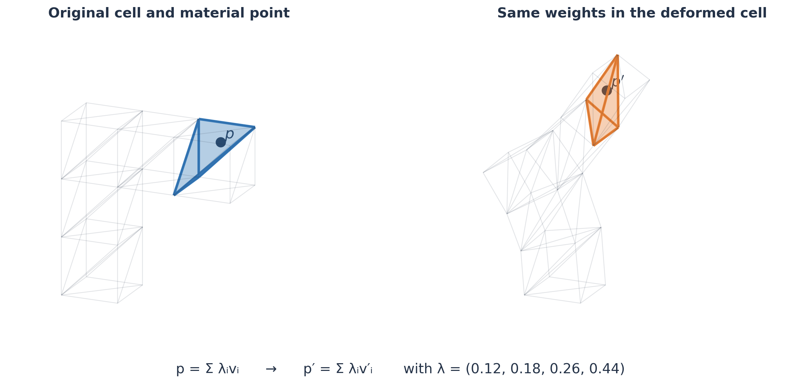

*One material point in the cantilever's original and S³-deformed tetrahedron. Its barycentric weights stay fixed while the shared vertices move.*

The caveat is that the $3\times3$ matrix above must be nonsingular. Its determinant is proportional to the tetrahedron's signed volume. A collapsed tetrahedron has no unique local inverse, while an inverted tetrahedron has a local algebraic inverse that reverses orientation.

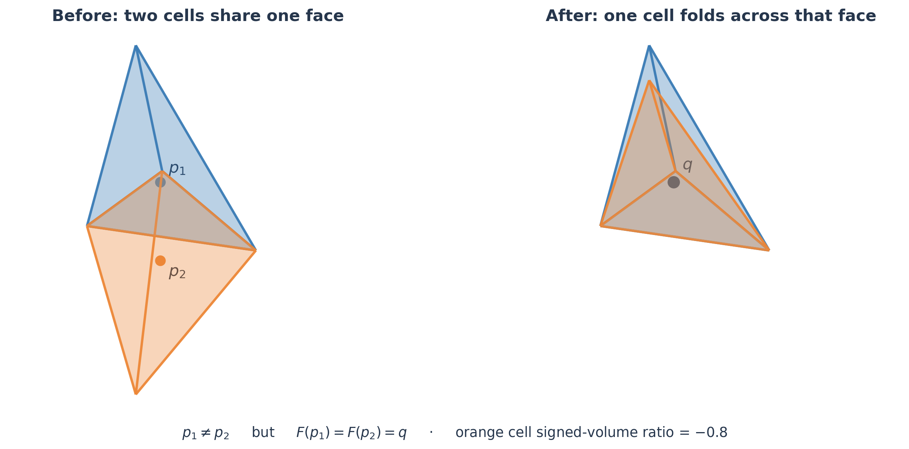

*This is a constructed example, not an S³ output. The orange cell folds through a shared face, so two different material points land at the same deformed point.*

Also, distinct tetrahedra can each have valid positive-determinant local maps but occupy the same region in deformed space; then a point can have multiple preimages and the global inverse is ambiguous.

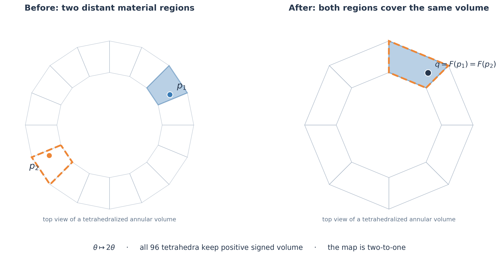

*Even positive cell volumes aren't enough. Here a connected annular volume wraps around itself twice: all 96 tetrahedra keep their orientation, but two distant cells occupy the same deformed space. This one is constructed too.*

All that is to say that the piecewise-affine tetrahedral map needs to be globally injective for unambiguous reprojection. S4 assumes a sufficiently well-behaved deformation, but it does not verify or guarantee global injectivity. That makes my skin crawl. Choosing the closest tetrahedron for a point outside the deformed mesh is a pragmatic fallback in the code, but it is not a proof or repair of injectivity.

### 2. Finding overhangs and deforming
Now we grab the face normals on the boundary manifold. If a tetrahedron has multiple exterior faces, S4 uses the one whose normal points most strongly downward. For that representative unit normal $n$, it computes $\theta=\arccos(n\cdot \hat z)$ and calls the cell an overhang when $\theta > 90^\circ + \texttt{MAX OVERHANG}$, or $120^\circ$ with the default setting. We do `NaN` out the bottom-most tets (the build plate) by a 0.3 mm height threshold as well, just so they don't participate in overhang correction.

Now we need some idea of adjacency. We build a graph where each node is a tetrahedron. Two nodes are connected when their tetrahedra share at least one vertex, and each edge is weighted by the Euclidean distance between their cell centers. We then run multi-source Dijkstra with every bottom cell as a source. For each tetrahedron we get an approximate discrete distance to the build plate and one shortest path to its closest bottom cell. This is **not** a surface geodesic; it is a shortest-path distance through the cell-center graph, and it works pretty well. S4 also used the paths for an additional heuristic called `in_air`: if a cell's path to the base passes through any cell center more than 1 mm above the starting cell, that cell is marked for extra rotation in the later target-angle calculation. This is a heuristic, not a physical support test.

We have overhang angles, but no direction. On the Core-R-Theta, each cell was restricted to rotating in its radial-vertical plane around the horizontal tangential axis. So we either rotate inward or outward in that radial plane. We only really use the overhang-marked cell distances from Dijkstra. Given at least three local samples from edge-neighboring overhang cells, S4 fits a plane and projects the fitted distance gradient onto the cell's radial direction in the XY plane. That radial derivative gives the signed rotation. With fewer than three samples, it falls back to the sign of the radial direction toward the closest bottom cell. Then it repeatedly averages the nonzero direction estimates across point-neighbor cells and their neighbors, using 30 smoothing passes by default.

For each overhanging cell, its basic corrective magnitude was its angular distance from the allowed boundary, $|(90^\circ+\texttt{MAX OVERHANG})-\theta|$. The `in_air` heuristic added $2(180^\circ-\theta)$. S4 then multiplied by the signed direction and by a rotation multiplier, giving a sparse initial field in which surface overhang cells had targets. Now we get to the fun part. Assign one unknown scalar rotation to each tetrahedron. The natural quadratic energy is:

$$
E(r)=
W\sum_{(i,j)\in\mathcal E}(r_i-r_j)^2
+\sum_{i\in\mathcal T}(r_i-r_i^*)^2.
$$

Here:

- $r_i$ is the unknown signed rotation of tetrahedron $i$;
- $r_i^*$ is its initial overhang-derived target;
- $\mathcal T$ is the set of cells with finite target values;
- $\mathcal E$ contains pairs of tetrahedra sharing a face; and
- $W$ is `NEIGHBOUR_LOSS_WEIGHT`, set to 20 in S4's default block.

The first sum is the Dirichlet energy on the dual graph of the tetrahedral mesh. The second is a set of soft boundary conditions.

Using the face-adjacency graph Laplacian $L$ and a diagonal target mask $M$, the same energy can be written
$$
E(r)=W r^T Lr+(r-r^*)^T M(r-r^*).
$$
Its stationary point satisfies the sparse linear system
$$
(W L+M)r=M r^*.
$$
For an untargeted interior cell, the corresponding row reduces to

$$
\sum_{j\in N(i)}(r_i-r_j)=0,
$$
or equivalently
$$
r_i=\frac{1}{|N(i)|}\sum_{j\in N(i)}r_j.
$$
In other words, under this quadratic formulation the field is discrete harmonic away from target cells: every cell takes the average rotation of its face neighbors. SciPy's `least_squares` expects a vector of residuals and minimizes the sum of their squares. To minimize the quadratic energy above, the residuals should be

$$
\sqrt{W}(r_i-r_j)
\quad\text{and}\quad
r_i-r_i^*.
$$

S4 instead returned

$$
W(r_i-r_j)^2
\quad\text{and}\quad
(r_i-r_i^*)^2
$$

as its residuals. `least_squares` squared them once more.

$$
E_{\text{S4 code}}(r)=
W^2\sum_{(i,j)\in\mathcal E}(r_i-r_j)^4
+\sum_{i\in\mathcal T}(r_i-r_i^*)^4.
$$

That is a quartic smoothing problem, not the quadratic graph-Laplacian problem. We end up fixing this later.

To find the new vertices under the deformation, we want a second optimization:

$$
\underset{X}{\operatorname{minimize}}
\quad
\sum_{c}
\left\|
N X_c - N V_c R_c^{\mathsf T}
\right\|_{F}^{2}.
$$

Here $V$ contains the original vertices, $X$ the deformed ones, $R_c$ the target rotation of cell $c$, and $N$ removes the tetrahedron's translation. The solve has to compromise whenever neighboring cells' requested rotations disagree. This intended objective is sparse, quadratic, and pretty easy to solve. However, independently selected rotations do not necessarily form a compatible deformation of one connected volume.

The literal S4 notebook repeated the same residual mistake here: it returned a squared Frobenius norm per cell to `least_squares`, which squared that value again. So S4's code actually minimized a sum of fourth powers of the cell residual norms, rather than the quadratic written above. Later versions separated the intended quadratic objective from that implementation detail.

### 3. Slice and map back

We extract the boundary surface of the deformed volume, hand that surface to Cura (or, in my case, automate the process with CuraEngine), and slice it into planar layers. We get to leverage all the nice slicer features, like wall ordering and retractions, that we would otherwise have to design ourselves.

The best part is that, when the volumetric map behaves, Cura's infill maps back along with its walls and becomes conforming infill on the curved layers. Conforming infill was one of the most tedious parts to figure out when I first started tinkering with nonplanar slicing. The most reliable method was to define an interior chart using nodal values across tetrahedra after generating a scalar field and just evaluate infill that way. I've tried a Douglas–Rado-inspired boundary-element technique (I might do a whole post on that) and Pinkall–Polthier discrete minimal surfaces. However, minimal surfaces do not guarantee a well-behaved family of surfaces between foliation layers, especially at Morse events like splits and merges.

After we parse the G-code, subdivide long moves, and locate each point inside the deformed tetrahedral mesh, we compute the point's barycentric coordinates in the deformed cell and map it back to the original. A horizontal Cura path in deformed space becomes a curved path on the original part, and the local deformation also supplies nozzle tilt, interpolated from surrounding cell and vertex rotations. S4 clips that tilt to the configured B-axis range, but clipping does not prove machine reachability or collision freedom. The rest is Core-R-Theta-specific post-processing to convert into machine coordinates, compensate for the nozzle offset, and alter extrusion to compensate for local deformation.

That's the gist of S4: find a smoothed deformation intended to reduce overhangs, slice it in Cura, and map the result back. It is simple, effective, and accessible for anyone who wants to get their hands dirty with nonplanar printing.

### 4. On the machine

Here are a few of the prints in progress on the Core R Theta. Watching the nozzle work around these shapes made all the geometry feel a lot less abstract.

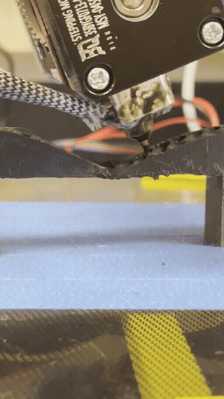

*Printing across a bridge.*

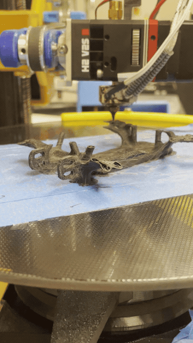

*The nozzle working around a branching frame.*

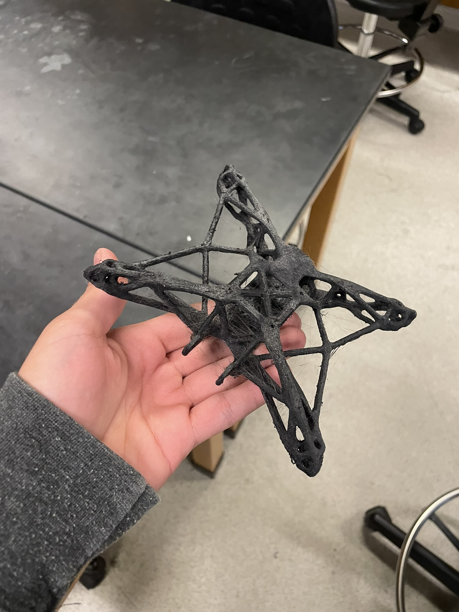

*The finished branching print, stringing and all.*

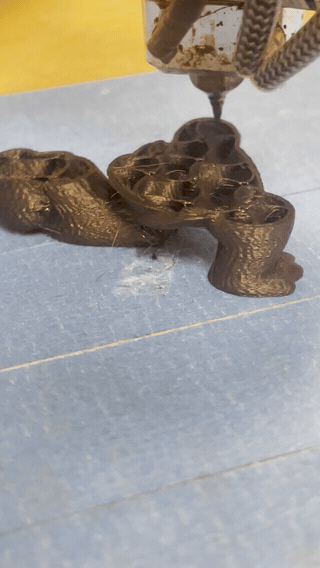

*Another print taking shape on the rotating bed.*

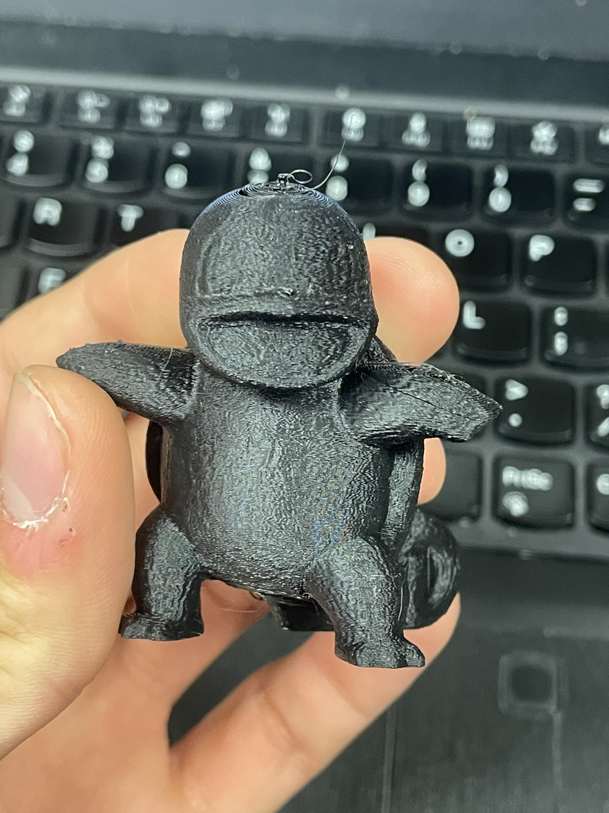

*One of the smaller finished prints.*

## S5

I didn't realize until later there are several other S4 forks called S5. But I stuck with it. The goal was to optimize a lot of the existing infrastructure. Python loops handled adjacency, while rotation smoothing and deformation each went through an iterative least-squares optimizer. Reprojection repeatedly solved tiny barycentric systems for individual G-code points. I started by assembling sparse operators directly and vectorizing anywhere I could. One of the first speedups came from taking the sparse structure seriously.

S4 used SciPy's list-of-lists (LIL) format when constructing Jacobians. The LIL matrix stores each row as mutable Python lists of column indices and values. But for thousands of numerical operations, sparse matrix-vector products and factorizations work better with compressed sparse row or column storage, since the nonzero values and their indices live in contiguous arrays. S4 rebuilt a LIL Jacobian during calls from the trust region `least_squares` optimizer and converted it to CSR afterward. But the mesh topology did not change during the solve and the locations and coefficients of the quadratic operator were already known. All while paying Python object and format-conversion costs to recover the same structure. Instead, I opted to generate the nonzero row and column indices and values in arrays, assembled the fixed operator once through COO, and converted it to a compressed format that solved a sparse linear system directly. For
rotation smoothing, that system was the graph-Laplacian equation
$$
(W L+M)r=M r^*.
$$
Much nicer on the hardware. It also removed repeated Jacobian reconstruction and unnecessary trust-region iterations while implementing the quadratic interpretation instead of S4's accidental quartic objective. I measured about a 12× geometric-mean speedup in rotation smoothing across the models I could compare, reaching 57× on a 9,038-tetrahedron dinosaur. For a fair timing comparison, I used extracted S4 reference functions with the squared-residual mistake corrected. Those numbers compare ways to solve the intended quadratic; they are not speedups against the literal quartic notebook.

Constructing adjacency was also using a painful amount of accumulating Python lists. This is fundamentally a combinatorial question as a sparse incidence matrix. Let $C$ be the cell-to-vertex matrix

$$
C_{cv}=
\begin{cases}
1,&\text{if tetrahedron }c\text{ contains vertex }v,\\
0,&\text{otherwise.}
\end{cases}
$$

Every row has exactly four nonzeros. The product

$$
S=C C^T
$$

then counts shared vertices:

$$
S_{ij}=|V_i\cap V_j|.
$$

For two distinct tetrahedra, $S_{ij}\ge1$ means they share a point,
$S_{ij}\ge2$ means they share an edge, and $S_{ij}=3$ means they share a face.
The diagonal is discarded, and only one triangle of the symmetric result needs
to be stored.

Here CSR was a natural representation for $C$: the matrix was assembled once
from vectorized cell and vertex indices, and SciPy performed the sparse product
in compiled code. The resulting neighbor sets matched the S4 reference exactly
on every compared model. The measured adjacency speedup grew with mesh size:
about 2.3× on 48 tetrahedra, 48.6× on 1,691 tetrahedra, and 242.6× on 9,038
tetrahedra. The geometric-mean improvement across those fixtures was about 17×.

LIL is great when a sparsity pattern is genuinely changing. In S5, connectivity was fixed, so I could generate the whole pattern in bulk and trade a lot of Python bookkeeping for pure, beautiful, gorgeous sparse linear algebra. Across the comparable fixtures, I measured geometric-mean speedups of about 17× for adjacency, 12× for rotation smoothing, 6× for deformation, and 489× for barycentric reprojection. The reprojection number is a speed comparison, not exact output parity for points outside the mesh: S4 used unsigned sub-volumes, while my affine map retains the barycentric signs. The [benchmark report](https://github.com/jac0bandres/S5_Slicer/blob/main/research/s5/bench_results/REPORT.md) has the per-model numbers and agreement checks.

But my deformations on more intricate meshes were getting uglier. There was one subtle issue I had overlooked.

### S5 solver was not actually converged

The old S5 deformation stage used SciPy's iterative `lsqr` routine with a hard
limit of 1,000 iterations. On small inputs that looked reasonable. On a large model with roughly 182,000 tetrahedra, the solver stopped far from the
least-squares solution. An incomplete solve produced severe distortion and thousands of inverted tetrahedra. I replaced it with a direct
sparse solve of the normal equations, factoring the matrix once and reusing the
factorization for the X, Y, and Z right-hand sides. On my tree model's real overhang-driven rotation field, the change was:

On the 182,281-tetrahedron tree, iteration-limited LSQR inverted 2,470 cells, with volume ratios from −226 to +105. The direct solve cut the inversion count to 620, with ratios from −77 to +255.

That's a real improvement, even if 620 inverted tetrahedra still make the volumetric map unreliable. The direct solver found the quadratic optimum more accurately, but that optimum was itself folded. Some target rotations in this experiment were around 163 degrees, varied spatially, and were not guaranteed to be compatible with a
continuous deformation. The objective contained no determinant barrier or other
injectivity constraint. The deeper issue was inherited from the S4 architecture: neither S4's
literal quartic deformation objective nor S5's quadratic interpretation enforced
local or global injectivity. That does not prove every S4 result is folded, but
it means S4's barycentric inverse relies on a property its deformation stage
does not guarantee. 

### Rebuilding S³ in Python

At this point, I wanted to implement the S³ paper equations in Python and reuse S4's environment (especially the Core-R-Theta kinematics and G-code parser). The implementation includes:
- tetrahedral differential operators
- support-free, strength-reinforcement, and surface-quality direction constraints
- quaternion-field smoothing
- scalar-field transfer and curved isosurfaces
- fixed and adaptive layers
- a Streamlit dashboard

This is essentially an accessible Python port I will keep maintaining in the future.

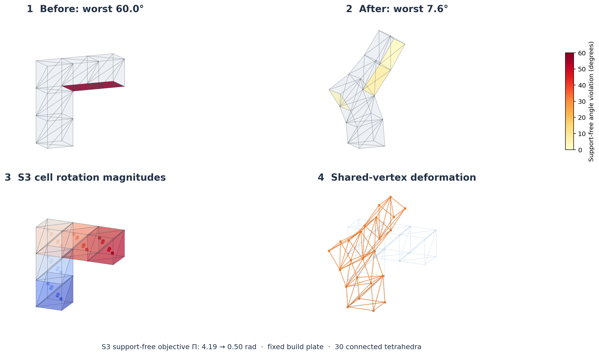

*Here is the 30-cell cantilever run through my S³ paper-equation solver. The support-free objective falls from 4.19 to 0.50 radians, and the worst overhang violation falls from 60° to 7.55°.*

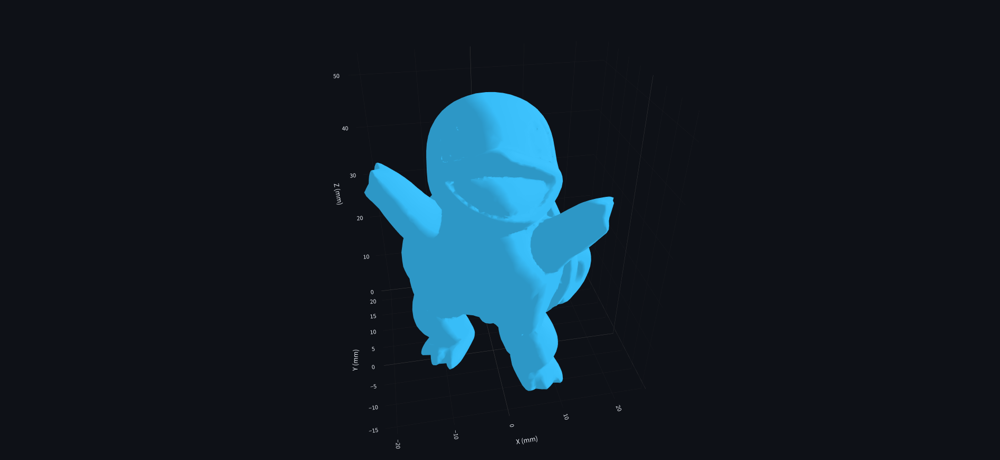

*The deformed Squirtle mesh after the S³ solve.*

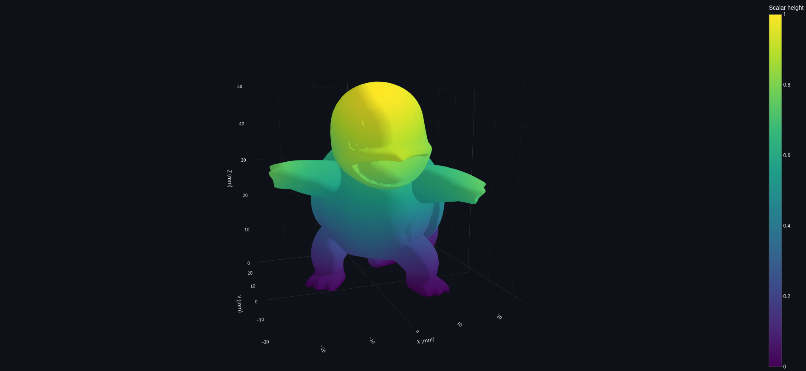

The main numerical change I made to both Python S³ solvers was adding residual-checked conjugate gradient for the large deformation solves. They solve related systems in different ways. My experimental paper-equation path solves Equation 12 for vertex positions and three per-tetrahedron scale variables together. After pinning the constrained variables, the remaining problem is

$$
\min_{x_f} \|A_f x_f-b_f\|_2^2.
$$

I should separate three things here. The [released S³ C++ solver](https://github.com/zhangty019/S3_DeformFDM/blob/main/ShapeLab/DeformTet.cpp) uses sparse direct factorization. In my workbench, the experimental paper-equation path automatically switches to CG at 10,000 free unknowns; I can also select it explicitly in the dashboard. The separate port of the released support-free solver uses three independent axis systems and automatically switches each one to CG when it has more than 30,000 unknowns. The default S³ path therefore uses CG for large meshes too. The thresholds and linear systems differ, and neither switch came from the original C++ code.

Direct factorization is reliable and often fast, but fill-in gets expensive as the mesh grows. My CG solver first scales the columns of the reduced matrix. With

$$
D=\operatorname{diag}(\|A_{f,:,1}\|_2,\ldots,\|A_{f,:,n}\|_2),
\qquad \widetilde A=A_fD^{-1},
$$

it solves

$$
\widetilde A^{T}\widetilde A\,y=\widetilde A^{T}b_f
$$

and recovers $x_f=D^{-1}y$. Column scaling acts as a simple diagonal preconditioner when the variables have very different magnitudes. The paper-equation path starts from the preceding deformation state instead of zero; the released-code port starts from the original positions and unit scales. The experimental paper-equation path asks for a relative normal-equation residual of $10^{-9}$ by default and allows up to 5,000 iterations; the released-code port uses $10^{-8}$ and the same iteration cap. If CG misses its target, the run reports non-convergence instead of quietly accepting the result.

This avoids LU fill-in, although I still assemble the sparse normal matrix. Small problems use the direct solve unless I select otherwise. CG changes how I solve the same quadratic; it cannot add an injectivity constraint or repair an incompatible rotation field.

I also cache and reuse the sparse factorization for **Equation 8**, the quaternion-blending step, while its matrix and pinned cells stay the same. That is a separate direct-solve optimization, not part of the CG change.

## Closing thoughts

I didn't end up with a new state-of-the-art slicer or a significant contribution. Zhang and his team did serious work, and this year taught me how hard the remaining geometry problems are. Neural Slicer takes another route, using a learned deformation mapping to build a slicing field. I want to spend some time with [that paper](https://arxiv.org/abs/2404.15061), too. Working on S4 has been one of the most impactful projects of my life. Even though I didn't find anything relatively novel, I dedicated almost an entire year trying to understand it. Before working on the Core-R-Theta, I never touched a 3D printer. I learned G-code, kinematics, power systems, control board configuration, and optimization from zero. I built an intuition for geometry and nonplanar slicing that earned me an internship at an incredible startup and took me all over the United States talking to top researchers from Berkeley, Purdue, and NASA. I effectively switched my career plans from being an electrical engineer to mastering optimization through a mathematics undergrad, hoping to aim for operations research. All those years tinkering on Roblox as a kid didn't go to waste.

## Acknowledgments

S5 descends from Joshua Bird's S4 slicer and builds on the ideas in Tianyu Zhang, Guoxin Fang, and collaborators' S³-Slicer. Thanks to Joseph and Mark for building alongside me, and to everyone who shared the code and research that made this work possible.
