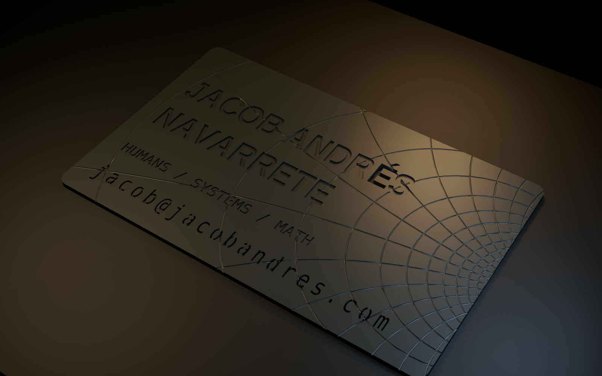

# Jacob Andrés Navarrete — printable business card

This is a one-color, support-free card derived from the website’s dark technical
language. A rectilinear complex plane is transformed with the same continuous
Möbius family used on the website, fixed at 10% inversion with its convergence
gap clipped beyond the midpoint of the right edge; the full name and
email prefix are recessed,
and the website is a mono stencil cut completely through the card.
The uppercase accented `É` in `ANDRÉS` is cut completely through the card.



## Print it

Use `output/jacob-andres-card.stl`. The finished card is **85.6 × 54 × 1.2 mm**.
Lay it flat on the build plate with the engraved face upward.

Suggested starting settings:

- 0.2 mm nozzle, 0.08 or 0.10 mm layer height
- 3 walls, 5 top/bottom layers, 15% infill
- PLA or PETG; no supports, brim, or raft
- Arachne/variable-width walls recommended for the website perforations
- Print at 100% scale

The `HUMANS / SYSTEMS / MATH` line and warped grid are 0.18 mm deep. The name and
`jacob@` are 0.38 mm deep. `jacobandres.com` continues on the same baseline, in
the same typeface and size, with 0.50 mm stencil bridges that prevent loose letter
islands. At the tightest point along the right edge, neighboring 0.42 mm grid
grooves retain approximately 1.02 mm of material, or more than five 0.2 mm nozzle
widths.

## Regenerate or customize

Blender 4.3+ is the only required tool:

```bash
blender --background --python business-card/generate_card.py
```

To check the exported size and manifold edges:

```bash
blender --background --factory-startup --python business-card/validate_card.py
```
